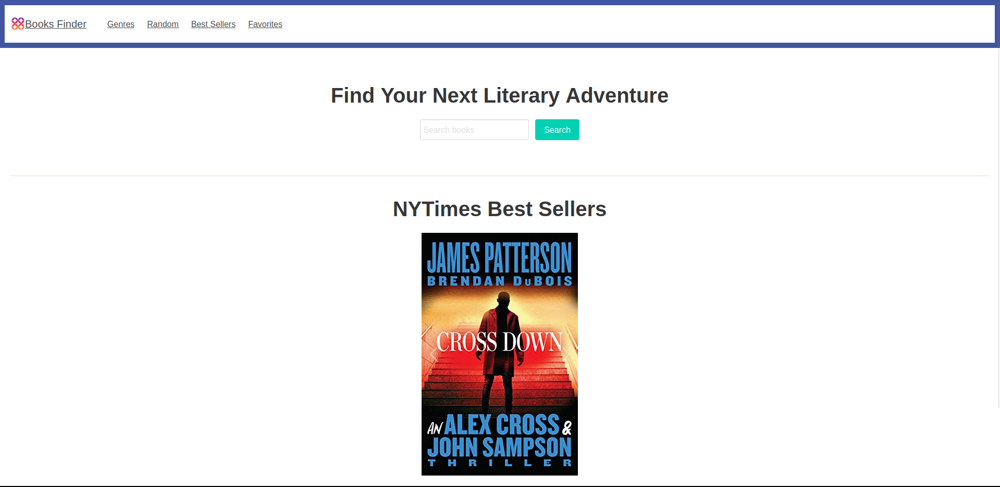

# Books Finder

## Description
Books Finder is a web application that allows you to find information on books, and also keep track of the ones you are reading!

# Screenshot

## Powered by 
- [Bootstrap](https://getbootstrap.com/)
- [Bulma](https://bulma.io/)
- [JQuery](https://jquery.com/)
- [Google Books](https://developers.google.com/books)
- [NYTimes Books](https://developer.nytimes.com/docs/books-product/1/overview)

## License
This repo is Licensed under the [MIT](LICENSE) liscense.
